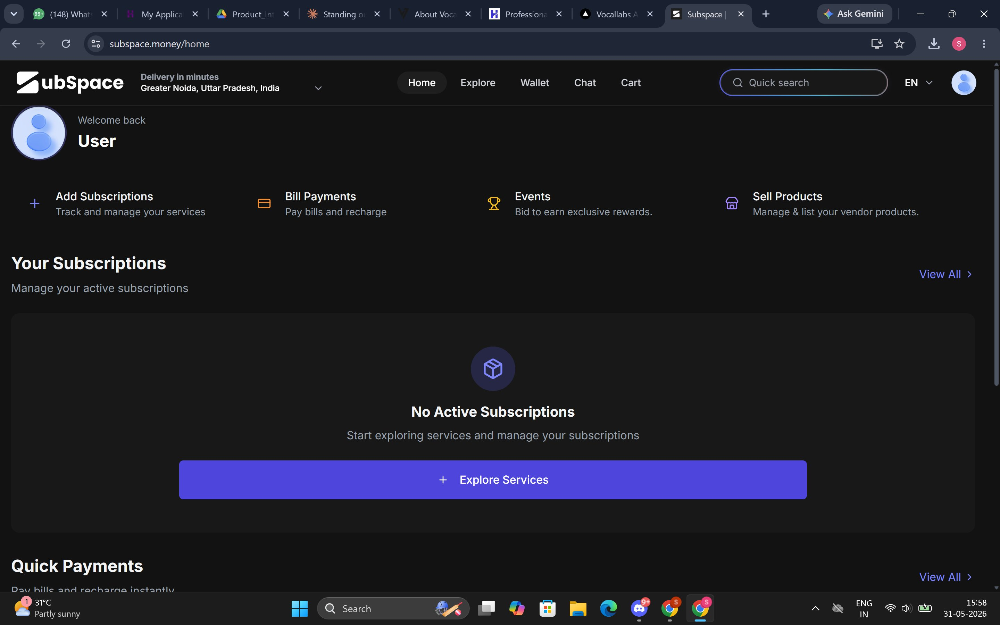
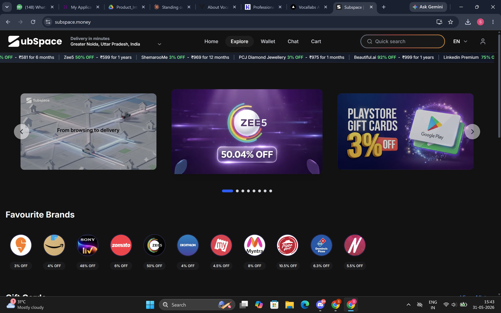
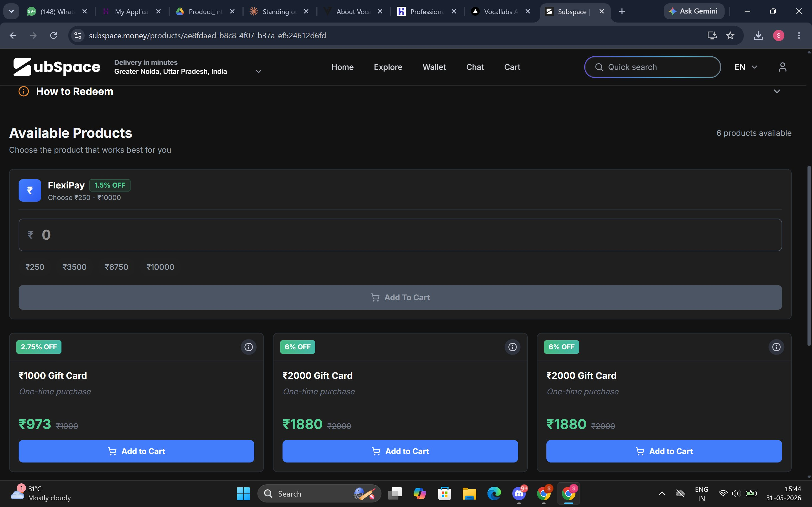

# Subspace.mone - Product Teardown
### Product Intern Assignment · Vocallabs.ai · 2026

> **Note:** I signed up and used the Subspace app before writing this. All observations below are from direct product usage - screenshots attached as evidence.

---

## Why Subspace, not Vocallabs?

Vocallabs is a legible B2B SaaS teardown with obvious competitors. Subspace is the harder problem - it sits at the intersection of **social trust dynamics**, **fintech**, and **marketplace cold-start**, all at once. The five feedbacks below each cover a distinct pillar with no overlap.

---

## 5 Sharp Feedbacks — One Per Pillar

| # | Pillar | Feedback | Priority |
|---|--------|----------|----------|
| 01 | UX | Shared-subscription flow puts all trust liability on strangers — zero safety net before money leaves | P0 |
| 02 | GTM & ICPs | Subspace runs 6+ different products on one screen — and acquires no user efficiently | P0 |
| 03 | Features / Services | The Negotiate API is the real moat — completely invisible to users on every screen | P1 |
| 04 | Competitor Analysis | The real competitor isn't an app — it's WhatsApp groups, and the product ignores this | P0 |
| 05 | Potential Collaborations | India's first local subscription marketplace exists in the description, not the go-to-market | P2 |

---

## Feedback 01 - UX
### Shared-subscription flow puts all trust liability on strangers — with zero safety net before money leaves

**Observed**
When joining a public sharing group (e.g. a Netflix Premium pool run by a stranger), the user pays their share immediately before the admin shares credentials. There is no escrow, no admin trust rating shown during the join flow, and the dispute CTA is buried 3 taps deep under Account → Help → Raise a concern.

Real Google Play reviews:
> *"if the subscriber doesn't allow you to login, subscription doesn't refund the amount"*
> *"you are dependent on admins"*
> *"would advise against shared subscription as you're dependent on admins"*

The only platform recourse is leaving a negative review - which triggers reactive support only after money is already lost.

**Problem**
Subspace's network-effects moat relies on public groups growing. But public groups require trust in strangers  trust the product currently offloads entirely to admin goodwill. Every betrayal event (admin goes silent, credential revoked post-payment) is a trust-destruction event at the **platform level**, not just the user level.

Porter's lens: low switching costs + high substitute availability (Telegram reseller groups) = one bad experience → permanent churn. This is a churn multiplier disguised as a support ticket.

**Ship Instead**
Introduce a **24-hour credential-delivery SLA with automatic escrow**: payment is held, released to the admin only after the member confirms access. Add an **Admin Trust Score** visible during the join flow - calculated from on-time delivery rate, dispute rate, response time - shown as a 3-tier badge (Verified / Standard / New). Every successful delivery becomes a compounding trust signal and reduces reactive support load structurally.

---

## Feedback 02 - GTM & ICPs
### Subspace runs 6+ different products on one screen — and acquires no user efficiently

**Observed (with screenshot evidence)**

After logging in, the homepage shows 4 quick-action tiles simultaneously:
- **Add Subscriptions** - "Track and manage your services"
- **Bill Payments** - "Pay bills and recharge"
- **Events** - "Bid to earn exclusive rewards"
- **Sell Products** - "Manage & list your vendor products"

*Screenshot: Logged-in homepage - 4 different product categories in the first screen alone, with "No Active Subscriptions" as the hero state*

The Explore page simultaneously shows a hero banner saying **"From browsing to delivery"** (rental product) next to Zee5 50% OFF and Google Play gift cards (deals product) - two completely different value props in the same frame.

*Screenshot: Explore page - the hero promotes the delivery/rental product while the ticker and brand grid promote subscription discounts*

"Events" (bid to earn rewards) and "Sell Products" (vendor listing) don't appear anywhere in Subspace's public marketing or Play Store description. A new user hitting this screen has zero idea what Subspace's primary job is.

**Problem**
₹36.5 Cr ARR with a 3-person team and zero external funding means Subspace cannot afford unfocused acquisition. A user who arrives for the Netflix share deal has a completely different retention hook than one who came for gadget rentals or bidding at events.

Porter's Five Forces: the threat of substitutes is **high in every single vertical** Subspace plays in - OTTplay (subscription mgmt), Splitwise (group finance), Magicpin (deals), Meesho (savings), Dunzo (quick delivery). Competing in all of them simultaneously with a 3-person team is a positioning death sentence.

**Ship Instead**
Define a primary ICP wedge — evidence points to **18–25 urban college students splitting OTT subscriptions with strangers for savings**. Single top-of-funnel hook: *"Split Netflix with 3 people you don't know. Pay ₹79. Done."* Strip the join-group flow to convert in under 90 seconds. All other features exist inside the app but don't appear in acquisition messaging until month 2 of retention.

This is a Jobs-to-be-Done argument: **own one job deeply before expanding.**

---

## Feedback 03 - Features / Services
### The Negotiate API is Subspace's most defensible moat - completely invisible on every screen

**Observed (with screenshot evidence)**

On a brand listing page (FlexiPay gift cards), the UI shows:
- ₹1000 Gift Card → **₹973** (2.75% OFF)
- ₹2000 Gift Card → **₹1880** (6% OFF)

*Screenshot: Brand listing page — discounted prices are shown, but nowhere does it explain HOW Subspace got these prices. No "we negotiated this." Looks identical to Cashkaro.*

The page says "6 products available" and "Choose the product that works best for you." The word **"negotiate"** appears nowhere. There is no explanation of the commercial mechanism behind the discount. The UI is indistinguishable from any cashback aggregator.

**Problem**
Subspace's bootstrapped profitability is structurally tied to its ability to negotiate better wholesale prices than any individual user could — this **is** the actual moat. But users perceive Subspace as "a coupon aggregator," so they comparison-shop against Cashkaro, Magicpin, and every deals Telegram channel.

Porter: bargaining power of buyers is high when they see identical products. Hiding the one genuinely hard-to-replicate thing means competing on brand recall against much better-funded players who can out-spend on acquisition.

**Ship Instead**
Surface the negotiation as a feature story on every brand page:
> *"Subspace negotiated price: ₹973 · Retail price: ₹1000 · You save: ₹27 - every single time"*

Add a single-screen "How we negotiate" explainer (one-time, skippable) during onboarding. This reframes Subspace from "deals app" to **"the app that fights on your behalf"** — a story Cashkaro and Magicpin literally cannot copy because they don't share the same commercial structure.

**Zero engineering. Copy change only. Ship in week 1.**

---

## Feedback 04 - Competitor Analysis
### Subspace's real competitor isn't another app — it's WhatsApp groups, and the product ignores this

**Observed**
Tracxn lists myPaisaa, MoneyClub, and Finlok as Subspace's competitors. But the dominant behavior Subspace is actually displacing is **not "using a competing app"** - it's informal WhatsApp groups where 4 friends split a Netflix plan, one person collects via UPI, and a shared Google Sheet tracks who paid. No app involved.

The logged-in homepage (Screenshot 1) shows "No Active Subscriptions" as the hero state for a new user — meaning the product has no answer for someone who just wants to share a plan they already have. The flow assumes the user comes to Subspace to discover and buy a subscription, not to coordinate one they already manage informally.

**Problem**
The product is built for conversion from a competing app, not conversion from the WhatsApp group workflow. There is no shareable payment link that non-app-users can pay into. No UPI-collect flow for the group admin. No WhatsApp-native reminder to members. The onboarding assumes both sides have Subspace installed — but in the incumbent behavior, only one person (the admin) would ever bother.

Porter: the real threat of substitute is a **zero-cost behavior**, not a funded competitor.

**Ship Instead**
Build a **"WhatsApp-first admin kit"**: one admin signs up, creates a group, gets a shareable payment link. Members click the link, pay via UPI — **no app install required for the paying member**. Admin app handles credential distribution and tracking.

This mirrors how Razorpay Payment Links worked — reducing barrier to zero for the paying party. Each successful link payment is a conversion funnel: *"Create your own group on Subspace and earn as admin."*

---

## Feedback 05 - Potential Collaborations
### India's first local subscription marketplace exists in the product description — not in the go-to-market

**Observed**
The logged-in homepage has a **"Sell Products"** tile — "Manage & list your vendor products." This is the only surface in the entire product where a local business could theoretically list. But:
- There is no dedicated partner/vendor onboarding page
- No case study of a local brand that has successfully listed
- No "List your subscription" CTA anywhere on the public website
- The Explore page (Screenshot 3) shows only major national brands (Zee5, Zomato, Amazon, Sony LIV) — zero local or hyperlocal providers

**Problem**
The local subscription marketplace is potentially Subspace's highest-margin business: brands pay a listing or distribution fee, users get hyperlocal deals, Subspace earns on both sides. Without a self-serve onboarding path for local providers, this stays at zero.

More critically, it is the one feature that makes Subspace **inimitable** — Zee5 discount sharing can be replicated; a hyperlocal marketplace of 500 Bengaluru-specific businesses (gyms, tiffin services, coaching classes) cannot.

Porter: this is the highest barrier to entry Subspace could build, and it is currently un-built despite a "Sell Products" tile sitting right on the homepage.

**Ship Instead**
Partner with 2–3 city-level SME aggregators — **NoBroker's vendor network, Justdial's business listings, or Razorpay's merchant base** — to onboard the first 50 local subscription providers via a lightweight Google Form → manual review → listing flow. No engineering sprint required.

Each local listing opens a new acquisition funnel: a Bengaluru tiffin service's 200 subscribers are Subspace users who would never install a "deals app."

---

## Prioritisation Logic

| Rank | Feedback | Pillar | Effort | Why Now |
|------|----------|--------|--------|---------|
| P0 #1 | Escrow + Admin Trust Score | UX | Medium | Core loop is bleeding trust — fix before scaling |
| P0 #2 | WhatsApp-first payment link | Competitor | Medium | Beats the real incumbent, not app rivals |
| P0 #3 | ICP wedge — own one job | GTM & ICPs | Zero (messaging) | Can ship this week, no engineering |
| P1 | Surface the Negotiate API story | Features | Low (copy only) | Repositions vs. every competitor overnight |
| P2 | Local marketplace B2B2C motion | Collaborations | High (partnerships) | Highest long-term moat, 60-day sprint |

**If I were joining Day 1:**
- Week 1 → Ship Feedback 03 (copy change, zero engineering)
- Week 2 → Prototype Feedback 04's WhatsApp payment link
- Month 2 → Run first local partner pilot for Feedback 05

---

## Framework Used

- **Porter's Five Forces** - threat of substitutes (high in every vertical), buyer bargaining power (high when product looks like a commodity), barriers to entry (currently low, local marketplace could build them)
- **Jobs-to-be-Done** - identifies the real incumbent behavior (WhatsApp groups, not competing apps) and the primary job users hire Subspace for

---

## Screenshots

| File | What it shows | Used in |
|------|--------------|---------|
| `screenshot_03_homepage_logged_in.png` | 6 different product tiles on one logged-in home screen | Feedback 02 |
| `screenshot_01_explore_page.png` | Mixed messaging - delivery hero + discount ticker simultaneously | Feedback 02 |
| `screenshot_02_brand_listing.png` | Brand page showing discounts with zero mention of how they were negotiated | Feedback 03 |

---

📄 Full formatted report: [`Subspace_Product_Teardown_2026.pdf`](./Subspace_Product_Teardown_2026.pdf)

---
*Product Intern Assignment · Vocallabs.ai / Subspace.money · May 2026*

